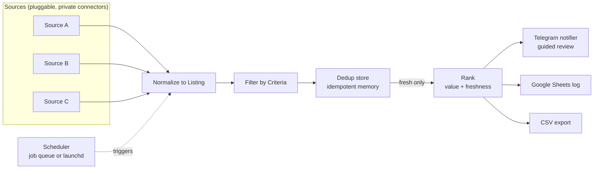

# HavenHunter

**A source-agnostic housing-search aggregation and alerting engine.**

Finding a place to rent in a tight market is a race. The good listings are gone
in hours, they are spread across many sites, and refreshing tabs by hand does
not scale. HavenHunter turns that race into a background job: it aggregates
several public sources, keeps only the listings that match your criteria,
remembers what it has already shown you, and pushes the new ones to Telegram
for a fast, guided review.


---

## What it does

- **Aggregates several public sources** behind one interface, so coverage grows
  without touching the rest of the system.
- **Filters against your own criteria** per profile: budget (with a ceiling per
  source), number of bedrooms, furnished, excluded areas, excluded keywords.
- **Never shows the same listing twice.** A persistent dedup store makes every
  run idempotent, so you only ever see what is genuinely new.
- **Ranks matches best-first.** A transparent heuristic scores each listing on
  value and freshness, so the strongest options come up first in the review.
- **Guided Telegram review.** Instead of a wall of results, matches arrive one
  card at a time with Validate / Skip / Done buttons, a live counter, an origin
  badge, and a ready-to-copy contact message in its own bubble.
- **Google Sheets tracking.** Validated listings and their status land in a
  shared sheet that doubles as a team-readable tracker.
- **Runs on a schedule** and survives restarts without losing its memory.

## Architecture

Every listing is normalized into a single `Listing` model the moment it enters
the system. From there the pipeline is a fixed sequence of independent stages,
and no stage knows or cares which source a listing came from.



The value of this shape is isolation. Adding a source is one new class behind
the `Source` interface. Changing how notifications look never touches
filtering. A source that fails or times out contributes nothing that run and
takes nothing else down with it.

## How the pipeline works

For one profile, every run does the same four things:

1. **Gather**: fan out across every configured source concurrently.
2. **Filter**: keep only listings the profile's `Criteria` accept.
3. **Dedup**: drop anything already seen, remember the rest.
4. **Rank**: order the fresh matches best-first with a transparent heuristic.
5. **Hand off**: send the ranked matches to the notifier and the logger.

Filtering is a pure predicate (`Criteria.accepts`), which keeps the rules easy
to reason about and easy to test. Deduplication is what makes reruns safe:
whether the scheduler fires or you trigger a search by hand, the result is only
ever the delta since last time.

## Tech stack

| Concern              | Choice                                             |
|----------------------|----------------------------------------------------|
| Language             | Python 3.10+, `asyncio`                            |
| Messaging / UI       | `python-telegram-bot` (inline keyboards, sessions) |
| Spreadsheet logging  | `gspread` + Google service-account auth            |
| Persistent dedup     | hosted database table keyed on listing URL         |
| Scheduling           | in-process job queue, or launchd / systemd agent   |
| Testing / CI         | `pytest`, GitHub Actions on 3.10 / 3.11 / 3.12     |
| Config               | YAML, one file, secret-free                        |

## Technical highlights

- **Clean source abstraction.** One async `Source` interface plus a small
  registry. Connectors are swapped in at runtime; the pipeline never imports a
  concrete one.
- **Idempotent by design.** The dedup store guarantees a listing is shown once
  and never lost across runs.
- **Transparent ranking.** A documented heuristic over value and freshness,
  normalized within the batch, orders matches best-first. No black box.
- **Interactive, stateful Telegram UX.** Per-chat review sessions, edit-in-place
  cards, instant toast feedback before any slower bookkeeping, and inline
  keyboards constrained to valid URL schemes by construction.
- **Config-driven multi-profile engine.** Two searches (for example a shared
  flat and a solo studio) run independently from a single YAML file, each with
  its own budgets and message template.
- **Defensive orchestration.** Per-source failure isolation, transient network
  errors swallowed instead of spammed, no match burned by a failed hand-off.
- **Secret hygiene.** Tokens, chat ids and credentials come from the
  environment. Nothing sensitive is committed.

## Project layout

```
src/havenhunter/
  models.py        # Listing + Criteria (the normalized shape and the rules)
  config.py        # YAML loader, env-backed secrets, profiles
  sources/
    base.py        # Source interface + registry
    example_source.py  # offline sample connector (real ones stay private)
  dedup.py         # DedupStore interface + in-memory implementation
  ranking.py       # transparent best-first scoring heuristic
  notifier.py      # Telegram guided-review flow
  sheets.py        # Google Sheets logging via service account
  export.py        # CSV export of a run
  pipeline.py      # gather -> filter -> dedup -> rank
  app.py           # wiring + Telegram commands + schedule + entry point
tests/
  test_pipeline.py # end-to-end run against the example source
  test_ranking.py  # ranking order and scoring
  test_export.py   # CSV export round-trip
deploy/            # launchd example + deployment notes
.github/workflows/ # CI (pytest on push)
```

## Quickstart

```bash
python -m venv .venv && source .venv/bin/activate
pip install -e .                # installs the package and its dependencies

cp .env.example .env            # fill in your Telegram token and chat id
cp config.example.yaml config.yaml   # adjust profiles and budgets

python -m havenhunter.app
```

Run the tests:

```bash
PYTHONPATH=src python -m pytest -q
```

The example source ships sample listings so the pipeline runs end to end with
no network and no secrets.

## A note on sources

Sources are pluggable and the production connectors are intentionally **not**
part of this public repository. The engine ships with a documented example
connector and a generic `Source` interface; real connectors implement the same
interface and are registered at runtime. This keeps the repository focused on
the architecture and the engineering, which is what it is meant to show.

## Author

**Gabin Spiewak**. Graduate student in finance, building software on the side.

- GitHub: [gab-spie](https://github.com/gab-spie)
- LinkedIn: [gabin-spiewak](https://www.linkedin.com/in/gabin-spiewak/)

## License

MIT. See [LICENSE](LICENSE).
